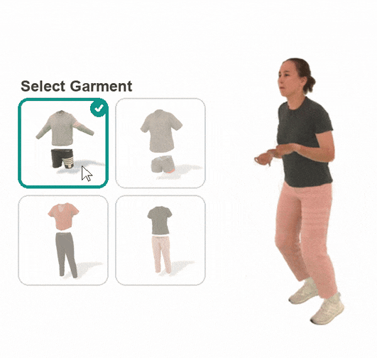

# <b> Gaussian Wardrobe: </b>:Compositional 3D Gaussian Avatars for Free-Form Virtual Try-on


<p align="center">
  
</p>

# Installation
0. Clone this repo.
1. Install environments.
```
# install requirements
pip install -r requirements.txt

# install diff-gaussian-rasterization-depth-alpha
cd gaussians/diff_gaussian_rasterization_depth_alpha
python setup.py install
cd ../..

# install styleunet
cd network/styleunet
python setup.py install
cd ../..

# install pytorch3d
git clone https://github.com/facebookresearch/pytorch3d.git
cd pytorch3d && pip install -e .

```
2. Download [SMPL-X](https://smpl-x.is.tue.mpg.de/download.php) model, and place pkl files to ```./smpl_files/smplx```.
3. Download [Lpips-weight](https://github.com/richzhang/PerceptualSimilarity/tree/master/lpips/weights/v0.1) and place pth files to ```.network/lpips/weights/v0.1```

# Data Preparation
We have experimented with [4D-Dress](https://eth-ait.github.io/4d-dress/) and [ActorsHQ](https://www.actors-hq.com/dataset) datasets
Following [GEN_DATA.md](./gen_data/GEN_DATA.md)

Note for ActorsHQ dataset: 1. **SMPL-X Registration.** We used the smplx registration offered [here](https://drive.google.com/file/d/1DVk3k-eNbVqVCkLhGJhD_e9ILLCwhspR/view?usp=sharing) by [Animatable Gaussians](http://animatable-gaussians.github.io/)

# Avatar Training
Take the subject 00134 from [4D-Dress](https://eth-ait.github.io/4d-dress/) as an example:
0. Prepare the training dataset using the instruction from the previous step
1. Download its checkpoint or start from scratch
2. Set the corresponding data_dir and net_ckpt_dir in the train section in ./configs/4d_dress/avatar.yaml
3. Run:
```
python main_avatar.py -c configs/4d_dress/avatar.yaml --mode=train
```

# Avatar Animation
Take the subject 00134 from [4D-Dress](https://eth-ait.github.io/4d-dress/) as an example:
0. Download the checkpoint for the subject
1. Prepare the testing dataset according to [GEN_DATA.md](./gen_data/GEN_DATA.md)
2. Set the corresponding data_dir and prev_ckpt in the test section in ./configs/4d_dress/avatar.yaml
2. Run:
```
python main_avatar.py -c configs/4d_dress/avatar.yaml --mode=test
```

Some example test animation examples are provided under ``assets`` folder, e.g. 156_test.mp4 and 185_ours.mp4

# Virtual Try-on
Take the subject 00134 and 00140 from [4D-Dress](https://eth-ait.github.io/4d-dress/) as an example
We provided a script ``generate_pos_script.py`` for generating the exchange dataset for [4D-Dress](https://eth-ait.github.io/4d-dress/) subjects:
0. Update the macros in ``generate_pos_script.py``
1. Run ``generate_pos_script.py`` for the target combination
2. Run:
```
python main_avatar.py -c configs/4d_dress/exchange.yaml --mode=exchange_cloth 
```

Some example exchange examples are provided under ``assets`` folder, e.g. 185_134_full.mp4 and 127_134_outer.mp4

For other combinations please follow the format in the ``configs/4d_dress/exchange.yaml`` configuration files

# Evaluation
We provide evaluation metrics in [eval/eval_metrics.py](eval/eval_metrics.py).

0. Generate the testing pose images
1. Then update the data_dir macros in [eval/eval_metrics.py](eval/eval_metrics.py).
2. Run
```
python eval/eval_metrics.py
```
# Acknowledgement
Our code is based on the following repos:
- [Animatable Gaussians](http://animatable-gaussians.github.io/)
- [3D Gaussian Splatting](https://github.com/graphdeco-inria/diff-gaussian-rasterization) and its [adapted version](https://github.com/ashawkey/diff-gaussian-rasterization)
- [StyleAvatar](https://github.com/LizhenWangT/StyleAvatar)

# Checkpoints

- 4D-Dress:
    - 00140: https://drive.google.com/file/d/1jIrfcN5cp6uzLfVRsYdzSpTqbfeB4Ovj/view?usp=sharing
    - 00134: https://drive.google.com/file/d/1jIrfcN5cp6uzLfVRsYdzSpTqbfeB4Ovj/view?usp=sharing
    - 00154: https://drive.google.com/file/d/1jIrfcN5cp6uzLfVRsYdzSpTqbfeB4Ovj/view?usp=sharing
    - 00163: https://drive.google.com/drive/folders/1B_KPSJhX6Q8XmD1gAxEq9m8UeSGCwXQD?usp=sharing


